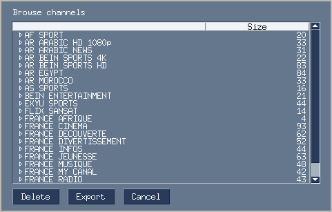

# m3u-iptv-cleaner
Desktop app that help you clean your large m3u 📺.

# How to use it ?
1. Load your large file 
2. Delete unecessery nodes 
3. Eport the result 📺

# Instalation

## From repo

🚦Python3

### git clone this repo
    $ git clone https://github.com/naoufalzerai/m3u-iptv-cleaner.git
### CD to the directory
    $ cd m3u-iptv-cleaner
### Install Requirement
    $ pip install -r requirements.txt
### Run the app
    $ python3 main.py

## From release 

Download the from : https://github.com/naoufalzerai/m3u-iptv-cleaner/releases
